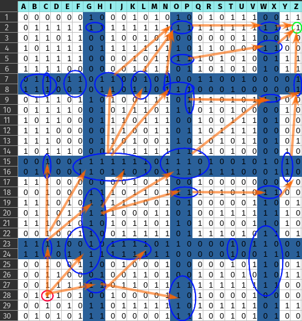

# Path Finding with TDD in C++

This is work in progress. The A-star algorithm has been tested already.

The main idea is to chop down a maze into smaller problems which can be analyzed
in parallel (i.e. multi-threaded environments).

What remains to do is to test and implement the ideas below.

## Idea to speed up A-star algorithm

In a 2D maze of zeros and ones try to find a path from the start to the end
node, if it exists. Steps allowed are only direct neighbors (should be possible
to also allow weighted sideways steps later, as well as multi-dimensional
spaces). Split up the 2D space into chunk using dividing lines with a thickness
of two. See image below.

NOTE: The chunk size can be chosen dynamically. Start in cell 28C, end in 2Z.

Algorithm:

 - [ ] similar to a-star on cell level, have two lists of chunks to search.
 - [ ] expand list of chunks according to simple heuristic, e.g. estimated
       shortest path to end node. See image below.

NOTE: after the connections between the chunks 0-7 have been analyzed in-chunk
search of these eight chunks can run in parallel.

 - [ ] dynamically analyze dividers between chunks for connectivity (chunk
       exists).
 - [ ] if chunks are connected via exits, try to search path thru them, 
       otherwise optimize path thru other chunks.
 - [ ] in order to find each cell's connectivity analyze the surrounding divider
       cells as shown below. This can assign each cell the maximum of 8
       connected cells.

 - [ ] for each chunk hold an array of cell's connection coordinates to other
       chunks.
 - [ ] walk the dividers using a 2-by-2 mask in order to simultaneously analyze
       which chunks are connected and their connecting cell's coordinates.
 - [ ] do not search chunks if they have no connection at all.

NOTE: no costs for exits have to be analyzed, only the final path via these 
exits will be assigned a cost.

Results:

 - [ ] guarantee to find shortest paths, like a-star does.
 - [ ] allows for parallel execution, because each divider between two chunks
       and the chunks themselves can be analyzed by different threads.

NOTE: The image shows a search at basic intensity where each pair of exits is
only in-chunk searched if it aligns with the general direction between start and
end node.

A solution to a maze is a list chunk exits which are connected via an
in-chunk path. In the above image for example, the right paths do not connect
the start node with the end node.

Additional idea:

 - [ ] heuristically increase the intensity for the in-chunk search. At first
       search only from exits close to start to exits close to end. If that is
       not enough, increase the cost of the in-chunk search and do a full NxM
       search for every exit (i.e. find a path from each exit to any of the
       other exits; one direction of the two directions is obviously enough).
 - [ ] let the chunk-level a-star algorithm operate simultaneously from start to
       end and from end to start to cut search time into half.
 - [ ] make it more likely to in-chunk search a chunk if it is more connected to
       other chunks.
 - [ ] use heuristic to choose different search algorithms for the in-chunk
       search (i.e. DFS or A-star).

## Meta
 
 - how to use [google tests](https://github.com/google/googletest/blob/main/googletest/samples/sample1_unittest.cc), i.e. `"gtest/gtest.h"`

## Misc resource (not yet read or watched)

 - https://www.youtube.com/watch?v=GC-nBgi9r0U
 - https://www.youtube.com/watch?v=-L-WgKMFuhE&list=PLFt_AvWsXl0cq5Umv3pMC9SPnKjfp9eGW
 - https://gamedev.net/forums/topic/703851-doing-astar-pathing-finding-in-threads/5412997/
 - https://www.youtube.com/watch?v=dJ3wSC8SI-4
 - https://www.youtube.com/watch?v=PzEWHH2v3TE
 - https://www.youtube.com/watch?v=ySN5Wnu88nE
 - https://www.youtube.com/watch?v=nhiFx28e7JY
 - https://www.youtube.com/watch?v=aKYlikFAV4k
 - https://www.youtube.com/watch?v=6TsL96NAZCo
 - https://www.youtube.com/watch?v=9du8tir7krI
 - https://www.youtube.com/watch?v=rop0W4QDOUI
 - https://www.youtube.com/watch?v=i0x5fj4PqP4
 - https://www.youtube.com/watch?v=ZMQbHMgK2rw
 - https://www.youtube.com/watch?v=A60q6dcoCjw
 - https://www.youtube.com/watch?v=9W8hNdEUFbc
 - https://www.youtube.com/watch?v=W1qvb86YOK0
 - https://stackoverflow.com/questions/61218945/best-algorithm-for-maze-solving
 - https://en.wikipedia.org/wiki/Maze-solving_algorithm
 - https://news.ycombinator.com/item?id=36087330
 - https://rosettacode.org/wiki/A*_search_algorithm#C++

